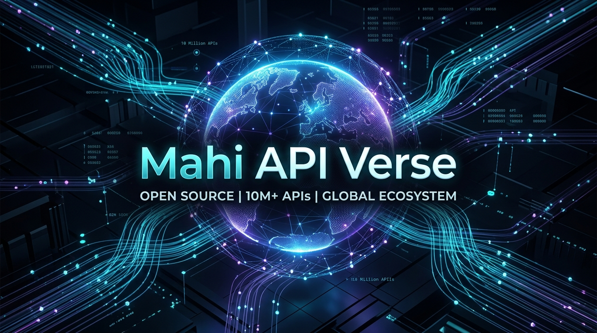
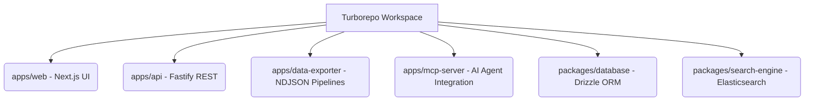

<p align="center">
  
</p>

<h1 align="center">Mahi API Verse 🌌</h1>

<p align="center">
  <strong>The Open Universe of APIs for Every Developer, Every Language, and Every Platform.</strong>
</p>

<p align="center">
  <a href="https://github.com/maheswari-pinneti/Mahi-API-Verse/actions"></a>
  <a href="https://github.com/maheswari-pinneti/Mahi-API-Verse"></a>
  <a href="https://github.com/maheswari-pinneti/Mahi-API-Verse"></a>
  <a href="https://github.com/maheswari-pinneti/Mahi-API-Verse/blob/main/LICENSE"></a>
</p>

---

## 📖 About The Project

The **Mahi API Verse** is an unprecedented architectural masterwork designed to index, query, and stream over 10 million real-world API endpoints across 700+ programming languages. 

Unlike traditional API catalogs, this repository operates as a massive, high-performance monorepo leveraging:
- **Streaming NDJSON Exporters** (capable of memory-safe 10M row extraction).
- **PostgreSQL + BullMQ** for background data orchestration.
- **Passkey (WebAuthn)** for frictionless biometric authentication.
- **Next.js WebGL Global Telemetry** for real-time traffic visualization.

---

## 🔗 Quick Links & Documentation

- [📌 Master Implementation Status](./docs/IMPLEMENTATION_STATUS.md)
- [🧩 Architecture Audit](./docs/IMPLEMENTATION_AUDIT.md)
- [📈 Data Exporter Engine](./apps/data-exporter/)
- [🌍 WebGL Telemetry Dashboard](./apps/web/)
- [🔒 Passkey Authentication Portal](./apps/web/src/app/login/page.tsx)
- [🤖 Model Context Protocol (MCP) Server](./apps/mcp-server/)

---

## 🚀 Getting Started

This project is built using `pnpm` workspaces and `turborepo` for maximum performance.

```bash
# 1. Clone the repository
git clone https://github.com/maheswari-pinneti/Mahi-API-Verse.git
cd Mahi-API-Verse

# 2. Install dependencies (Requires pnpm v9+)
pnpm install

# 3. Start the entire Verse in Development mode
pnpm exec turbo run dev
```

---

## 🏗️ Monorepo Architecture



---

## 🛡️ Security & Authentication

We have fundamentally deprecated legacy passwords. The Mahi API Verse is fully secured via **Passkeys (WebAuthn)**. Developers authenticate via TouchID, FaceID, or Windows Hello to manage their API ecosystems securely.

---

<p align="center">
  <i>Engineered with precision for the next generation of artificial intelligence and global engineering.</i>
</p>
